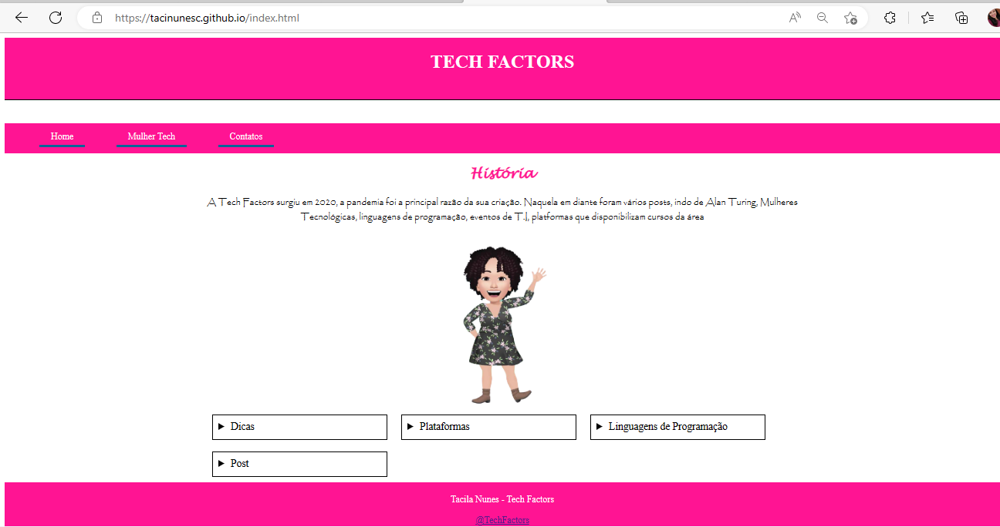
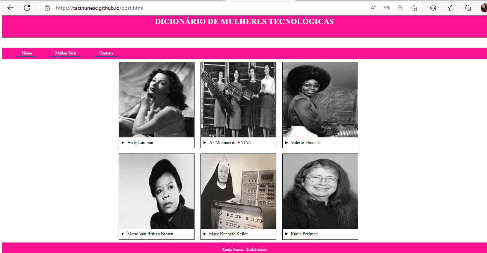

# Projeto Autoral Mulheres Tecnoloógicas Desenvolvido no EuProgramo FrontEnd II da Programaria

 
  
  
  

# Introdução

- 1º: Eu tenho uma IG de T.I desde de 2020
- 2º: Quando foi falado que no programa teria que fazer um projeto autoral fiquei animada, pois poderia este projeto que estou algum tempo querendo por em prática
- 3º: O curso me ajudou nesta base

# Descrição Home

- Inicialmente criei o index, onde ficou a página home, com descrição da página Tech Factors, nessa página ainda utilizei do carrosel para por itens de publicações do instagram da Tech Factors. Ainda no index, foi criado um footer com autoria da página e o link que direciona para o instagram da Tech Factors;
- Também se criou um menu superior, neste tinha as opções: home, mulher tech que redireciona para o arquivo post.html, e contatos.

 

# Descrição Mulher Tech
- Em Mulher Tech fiz um carrosel com 6 mulheres que revolucionaram a tecnolgia desde os primordios dos tempos, indo de uma atriz famosa, mulheres que participaram do projeto ENIAC, um enfermeira que teve a idéia do sistema de seguração, mulheres com participação em criação de linguagens de programação, etc.
- Segue a figura abaixo.

 

